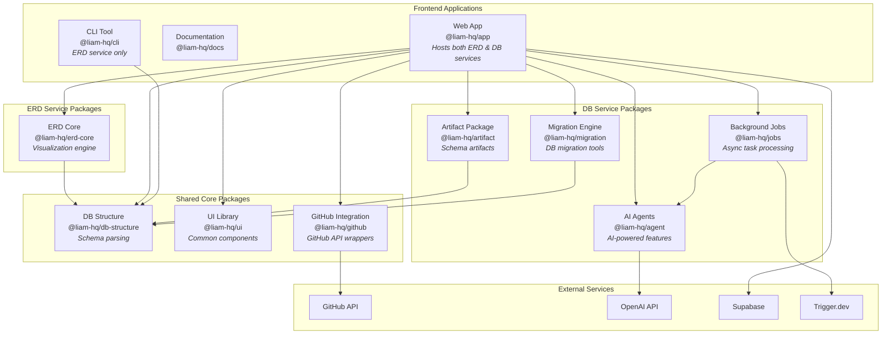
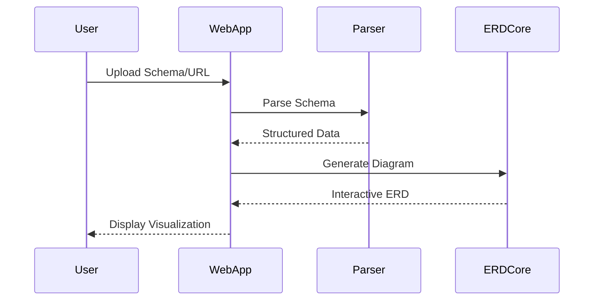
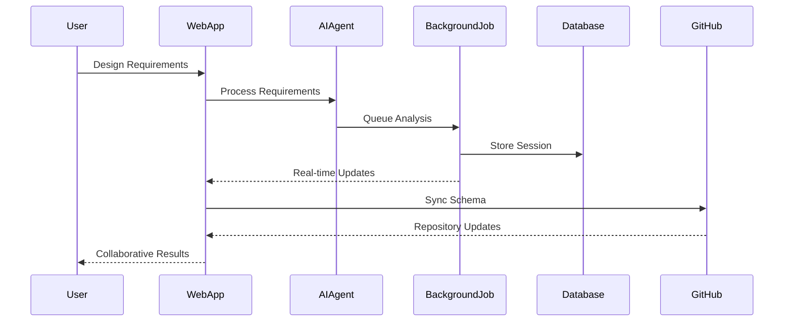

# Liam Platform System Specification

## 1. Overview
### 1.1 Purpose
The Liam Platform consists of two complementary services:
- **Liam ERD**: A database schema visualization tool that generates interactive Entity-Relationship Diagrams
- **Liam DB**: An AI-powered database design and management service that helps create, optimize, and maintain database schemas

Together, these services provide a comprehensive solution for database development lifecycle, from initial design to visualization and ongoing maintenance.

### 1.2 Scope
The platform encompasses:

#### Liam ERD Service
- **Auto-generation**: Interactive ER diagrams directly from database schema files
- **Multi-format Support**: Ruby on Rails (schema.rb), Prisma, PostgreSQL SQL, tbls format (MySQL/PostgreSQL)
- **Interactive UI**: Panning, zooming, filtering, and table relationship highlighting
- **Web Version**: Public repository visualization by prepending URL with liambx.com/erd/p/
- **CLI Version**: Local generation and CI/CD integration with npm installation
- **Sharing & Integration**: Public URL sharing and documentation embedding support
- **Performance**: Handles large schemas with 100+ tables efficiently

#### Liam DB Service
##### Core Solutions
- **Schema**: Auto-generation from GitHub repositories with real-time synchronization
- **Deep Modeling**: Professional team simulation (PM, DB architect, QA) for expert-level design
- **Multimodal Design**: Database design from UI images, voice, and text inputs
- **Instant Database**: Real-time schema validation with live SQL execution
- **Native Language to SQL**: Natural language query conversion with schema consistency

##### Core Features
- **AI-Powered Design**: Schema generation and optimization from natural language requirements
- **Collaborative Workspace**: Real-time multi-user editing with version control
- **Migration Management**: Database migration generation, export, and test data creation

### 1.3 Terminology
- **ERD**: Entity-Relationship Diagram visualizing database structure
- **Schema**: Database structure definition in various formats
- **Node**: Visual representation of a database table in the diagram
- **Edge**: Visual representation of relationships between tables
- **Agent**: AI-powered component for specific tasks (PM, QA, DB design)
- **Artifact**: Generated documentation or analysis results
- **Design Session**: Collaborative database design workspace
- **Schema Version**: Point-in-time snapshot of database schema
- **Deep Modeling**: AI simulation of professional development team expertise
- **Multimodal Design**: Database design from multiple input types (voice, image, text)
- **Instant Database**: Real-time schema validation with live SQL execution
- **Native Language to SQL**: Natural language to SQL query conversion system

## 2. Functional Requirements
### 2.1 Core Features
#### 2.1.1 Liam ERD Service
##### 2.1.1.1 Schema Visualization
- **Schema Parsing**: Parse database schemas from supported formats (Rails schema.rb, Prisma, PostgreSQL SQL, tbls)
- **Interactive Diagrams**: Generate ER diagrams with pan, zoom, and node selection capabilities
- **Table Details**: Display comprehensive information including columns, data types, and constraints
- **Relationship Mapping**: Show foreign key relationships with cardinality indicators and connection lines
- **Smart Filtering**: Support for focusing on specific tables and hiding/showing related entities

##### 2.1.1.2 CLI Tool & CI/CD Integration
- **Interactive Setup**: `liam init` command for guided configuration and GitHub Actions workflow generation
- **ERD Generation**: `liam erd build` automatically generates diagrams from schema files
- **Multi-format Support**: Handles PostgreSQL, Rails schema.rb, Prisma, and tbls formats
- **Static Site Output**: Generates self-contained dist folder with index.html, schema.json, and assets
- **CI-Friendly Design**: Automatic diagram updates on every commit with deployment to GitHub Pages, Vercel, Netlify, or Cloudflare Pages
- **Custom Configuration**: Flexible output directory with `--output-dir` option
- **Always Up-to-date**: Ensures teams have the latest schema visualization automatically

##### 2.1.1.3 Documentation & Export (Not implemented)
- Share diagrams via public URLs (liambx.com/erd/p/ prefix)
- Embed diagrams in documentation
- Generate schema documentation from parsed structures
- Export capabilities for integration with external tools

##### 2.1.1.4 GitHub Integration
- **PR Review**: Automated review for schema changes in pull requests
- **Change Detection**: Identify and analyze schema modifications
- **Comment Generation**: Post review feedback directly on PRs
- **GitHub App**: Seamless integration via GitHub App installation

#### 2.1.2 Liam DB Service
##### 2.1.2.1 Schema - Auto-generation & Synchronization
- **Repository Analysis**: Automatically detect and parse schema files from GitHub repositories
- **Real-time Sync**: Continuous monitoring and updates from connected repositories
- **Schema Baseline**: Establish persistent schema foundation for development
- **Version Control**: Seamless GitHub integration for schema history

##### 2.1.2.2 Deep Modeling - Professional Team Simulation
- **Multi-Agent System**: AI agents simulating PM, DB architect, and QA perspectives
- **Expert Design**: Enable any developer to achieve professional-grade results
- **Holistic Analysis**: Combined insights from business, technical, and QA viewpoints
- **Iterative Refinement**: Continuous improvement through multi-agent collaboration

##### 2.1.2.3 Multimodal Design - Multiple Input Processing
- **Visual Input**: Extract database requirements from UI wireframes and mockups
- **Voice Input**: Generate schemas from spoken requirements
- **Text Analysis**: Transform written specifications into optimized schemas
- **Cross-Modal**: Ensure coherent design across all input types

##### 2.1.2.4 Instant Database - Real-time Validation
- **Live Updates**: Immediate visualization of schema modifications
- **SQL Testing**: Execute actual SQL statements for risk-free verification
- **Interactive Validation**: Test data operations and constraints in real-time
- **Safe Environment**: Risk-free experimentation with rollback capabilities

##### 2.1.2.5 Native Language to SQL - Query Conversion
- **Natural Language**: Convert human questions to executable SQL queries
- **Schema-Aware**: Ensure queries work with current database structure
- **Query Optimization**: Suggest efficient patterns based on schema
- **Data Integrity**: Maintain constraints and relationships automatically

##### 2.1.2.6 Authentication & Collaboration
- **GitHub OAuth**: Secure authentication via GitHub accounts
- **User Management**: Profile and settings management for each user
- **Organization Support**: Team collaboration and organization-level access
- **Session Management**: Persistent design sessions with version history

##### 2.1.2.7 Background Processing
- **Async Operations**: Handle long-running tasks with Trigger.dev
- **Job Management**: Queue and monitor background processes
- **Error Recovery**: Automatic retry mechanisms for failed operations
- **Real-time Updates**: Push notifications for job completion

### 2.2 Use Cases
#### 2.2.1 Liam ERD Use Cases
1. **Quick Schema Visualization**
   - Developer pastes GitHub URL with schema file
   - System instantly generates interactive ERD
   - No login required for public repositories

2. **Schema Documentation**
   - Upload schema file to generate ERD
   - Export diagram for documentation
   - Share with team via public URL

#### 2.2.2 Liam DB Use Cases
1. **Natural Language Database Design**
   - Describe requirements in plain language or upload UI mockups
   - AI generates optimized database schema with professional-grade design
   - Iterate and refine through conversation

2. **Collaborative Schema Development**
   - Create design session with team members
   - Real-time collaborative editing with AI assistance
   - Instant validation and migration generation

3. **GitHub Repository Integration**
   - Connect to existing GitHub repository
   - Auto-detect and sync schema changes
   - Maintain schema baseline for continuous development

### 2.3 Constraints
TBD (To Be Determined) - Specific system constraints will be defined based on:
- Performance benchmarks from real-world usage
- User feedback and requirements
- Technical limitations discovered during development
- Business requirements and SLAs

## 3. Technical Architecture
### 3.1 System Components


### 3.2 Data Model
The Liam platform uses TypeScript interfaces throughout for type safety and consistency. Key data models are defined in the following locations:

#### Core Schema Types
- **Database schema parsing**: `@liam-hq/db-structure/src/types.ts`
- **Parser implementations**: `@liam-hq/db-structure/src/parser/types.ts`
- **Schema validation**: `@liam-hq/db-structure/src/parser/supportedFormat/schema.ts`

#### ERD Service Types
- **Visualization components**: `@liam-hq/erd-core/src/types/` (when implemented)
- **Node and edge definitions**: ERD-specific interfaces for React Flow integration

#### DB Service Types
- **AI agent interfaces**: `@liam-hq/agent/src/` (chat workflow and agent types)
- **Design session models**: Session management and collaboration types
- **Artifact generation**: Output and export type definitions

#### Shared Application Types
- **UI components**: `@liam-hq/ui/src/` (component prop interfaces)
- **Web application**: `@liam-hq/app/` (page and component specific types)

**Note**: Refer to the actual implementation files for current interface definitions, as these evolve with development. The codebase uses TypeScript strict mode to ensure type safety across all packages.

### 3.3 API Specification
The Liam platform exposes APIs through multiple interfaces for different use cases. API definitions and implementations are documented in the following locations:

#### Web Application APIs
- **REST endpoints**: `frontend/apps/app/app/api/` (Next.js API routes)
- **GitHub webhook handlers**: `frontend/apps/app/app/api/webhook/github/route.ts`
- **Database operations**: Supabase client APIs via `@/libs/db/`

#### CLI Command APIs
- **Command definitions**: `frontend/packages/cli/src/commands/` (CLI command implementations)
- **ERD generation**: CLI-specific schema processing and output generation
- **GitHub integration**: Repository setup and authentication flows

#### Package APIs
- **ERD Core**: `@liam-hq/erd-core/src/` (visualization and rendering APIs)
- **DB Structure**: `@liam-hq/db-structure/src/` (schema parsing and validation APIs)
- **GitHub Integration**: `@liam-hq/github/src/` (GitHub API wrappers and utilities)
- **Background Jobs**: `@liam-hq/jobs/src/` (Trigger.dev job definitions and handlers)

#### External Integrations
- **GitHub API**: OAuth, repository access, and webhook processing
- **OpenAI API**: AI-powered schema generation and analysis
- **Supabase API**: Database operations, authentication, and real-time subscriptions
- **Trigger.dev API**: Background job orchestration and monitoring

**Note**: Refer to the individual package SPEC.md files for detailed API contracts, request/response schemas, and usage examples. Each package documents its specific interfaces and integration patterns.

### 3.4 Data Flow
#### 3.4.1 Liam ERD Service Flow


#### 3.4.2 Liam DB Service Flow


**Note**: Detailed data flows for specific operations (schema parsing, AI processing, GitHub integration) are documented in the respective package SPEC.md files.

## 4. System Interfaces
### 4.1 External Interfaces
#### 4.1.1 Web Interface
- Modern responsive web application
- Real-time collaboration features
- Export capabilities (PNG, SVG, PDF)

#### 4.1.2 CLI Interface
```bash
# Initialize project
npx @liam-hq/cli init

# Liam ERD commands
npx @liam-hq/cli erd build --input schema.sql --format postgresql
npx @liam-hq/cli erd visualize --url github.com/user/repo/schema.rb

# Liam DB commands
npx @liam-hq/cli db design --requirements "user management system"
npx @liam-hq/cli db migrate --from schema-v1.sql --to schema-v2.sql
npx @liam-hq/cli db generate --input design-session.json --format prisma

# Advanced solution commands
npx @liam-hq/cli db auto-sync --repo github.com/user/repo
npx @liam-hq/cli db multimodal --input wireframe.png --voice requirements.mp3
npx @liam-hq/cli db instant-validate --schema schema.sql --test-queries queries.sql
npx @liam-hq/cli db nlp-query --question "show me all active users" --schema schema.sql

# Shared commands
npx @liam-hq/cli github setup
npx @liam-hq/cli auth login
```

#### 4.1.3 API Endpoints
- REST API for schema processing
- WebSocket for real-time updates
- Webhook endpoints for GitHub integration

### 4.2 Internal Interfaces
- Package communication via TypeScript interfaces
- Event-driven architecture for async operations
- Shared type definitions across packages

### 4.3 Third-party Integrations
- GitHub API for repository access
- OpenAI API for AI features
- Supabase for data persistence
- Trigger.dev for job orchestration

## 5. Non-functional Requirements
TBD (To Be Determined) - Non-functional requirements will be defined based on:
- Performance benchmarks from user testing and production usage
- Business requirements and SLA expectations  
- Technical constraints discovered during development
- User feedback and usage patterns

**Note**: Specific performance, security, and scalability requirements will be documented as the platform matures and usage patterns become clear.

## 6. Implementation Details
### 6.1 Monorepo Structure
```
liam/
├── frontend/
│   ├──  apps/
│   │   ├── app/          # Main web application
│   │   ├── docs/         # Documentation site
│   │   ├── packages/
│   │   │   ├── cli/          # Command-line tool
│   │   │   ├── erd-core/     # ERD visualization
│   │   │   ├── db-structure/ # Schema parsing
│   │   │   ├── ui/           # UI components
│   │   │   ├── github/       # GitHub integration
│   │   ├── internal-packages/
│   │   │   ├── jobs/         # Background jobs
│   │   │   ├── agent/        # AI agents
│   │   ├── supabase/             # Database migrations
│   │   ├── scripts/              # Development scripts
```

### 6.2 Package Ownership Matrix
| Package | Liam ERD | Liam DB | Shared |
|---------|----------|---------|--------|
| @liam-hq/app | ✓ | ✓ | ✓ |
| @liam-hq/cli | ✓ | ✓ | ✓ |
| @liam-hq/erd-core | ✓ | - | - |
| @liam-hq/artifact | - | ✓ | - |
| @liam-hq/migration | - | ✓ | - |
| @liam-hq/db-structure | ✓ | ✓ | ✓ |
| @liam-hq/ui | ✓ | ✓ | ✓ |
| @liam-hq/github | ✓ | ✓ | ✓ |
| @liam-hq/jobs | ✓ | ✓ | ✓ |
| @liam-hq/agent | ✓ | ✓ | ✓ |

### 6.3 Error Handling
#### 6.3.1 Error Classification
- **User Errors**: Invalid input, authentication failures
- **System Errors**: Service unavailable, database connection issues
- **Integration Errors**: GitHub API failures, AI service timeouts

#### 6.3.2 Error Recovery
- **Retry Logic**: Exponential backoff for transient failures
- **Fallback Mechanisms**: Graceful degradation when services are unavailable
- **User Notification**: Clear error messages with actionable next steps

#### 6.3.3 Error Monitoring
- **Sentry Integration**: Exception tracking and performance monitoring across web applications
- **OpenTelemetry**: Distributed tracing with Vercel OTel integration for request monitoring
- **Langfuse**: AI operation tracing and analytics for LLM interactions
- **Request Error Capture**: Automatic error capture for Next.js API routes via `Sentry.captureRequestError`
- **Environment-based Configuration**: Different monitoring setups for development, staging, and production

## 7. Testing Strategy
### 7.1 Testing Priorities
#### 7.1.1 High Priority (Must Have)
**Critical Business Functions:**
- Schema parsing for all supported formats (Rails, Prisma, PostgreSQL, tbls)
- ERD visualization and rendering accuracy
- AI agent workflow execution (PM → DB → QA → Review)
- AI output quality evaluation and benchmarking
- GitHub OAuth authentication and repository access
- Database operations and data persistence

**Security & Data Integrity:**
- Authentication and authorization flows
- Input validation and sanitization
- API security (rate limiting, CSRF protection)
- Background job security and error handling

#### 7.1.2 Medium Priority (Should Have)
**User Experience Flows:**
- Complete ERD generation and visualization workflows
- Collaborative design session management
- GitHub webhook processing and PR analysis
- Error handling and user notifications
- CLI command execution and output validation

**Integration Boundaries:**
- Package-to-package communication
- External API integrations (GitHub, OpenAI, Supabase)
- Real-time collaboration features
- Migration generation and validation

#### 7.1.3 Low Priority (Nice to Have)
**Performance & Optimization:**
- Large schema handling (100+ tables)
- Concurrent user load testing
- Memory usage optimization
- Visual regression testing for UI components

**Advanced Features:**
- Export functionality edge cases
- Advanced visualization modes
- Cross-browser compatibility
- Accessibility compliance testing

### 7.2 Test Types and Coverage
#### 7.2.1 Coverage Requirements
- **Unit Tests**: 80% minimum coverage for core packages
- **Integration Tests**: 100% coverage for critical paths (auth, data processing, core workflows)
- **E2E Tests**: All primary user journeys for both ERD and DB services
- **API Tests**: All endpoints with various input scenarios

#### 7.2.2 Test Distribution
- **@liam-hq/db-structure**: Parser accuracy and error handling (High Priority)
- **@liam-hq/erd-core**: Visualization rendering and performance (High Priority)
- **@liam-hq/agent**: AI workflow execution and error recovery (High Priority)
- **@liam-hq/github**: Repository access and webhook processing (Medium Priority)
- **@liam-hq/jobs**: Background job execution and retry logic (Medium Priority)
