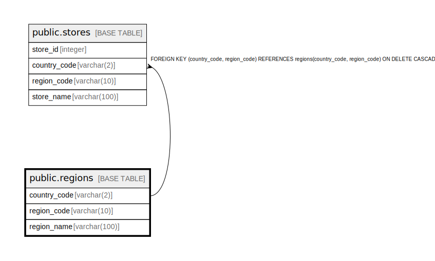

# public.regions

## Description

## Columns

| Name | Type | Default | Nullable | Children | Parents | Comment |
| ---- | ---- | ------- | -------- | -------- | ------- | ------- |
| country_code | varchar(2) |  | false | [public.stores](public.stores.md) |  |  |
| region_code | varchar(10) |  | false | [public.stores](public.stores.md) |  |  |
| region_name | varchar(100) |  | true |  |  |  |

## Constraints

| Name | Type | Definition |
| ---- | ---- | ---------- |
| regions_pkey | PRIMARY KEY | PRIMARY KEY (country_code, region_code) |

## Indexes

| Name | Definition |
| ---- | ---------- |
| regions_pkey | CREATE UNIQUE INDEX regions_pkey ON public.regions USING btree (country_code, region_code) |

## Relations

---

> Generated by [tbls](https://github.com/k1LoW/tbls)
