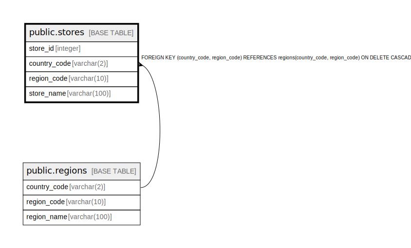

# public.stores

## Description

## Columns

| Name | Type | Default | Nullable | Children | Parents | Comment |
| ---- | ---- | ------- | -------- | -------- | ------- | ------- |
| store_id | integer | nextval('stores_store_id_seq'::regclass) | false |  |  |  |
| country_code | varchar(2) |  | true |  | [public.regions](public.regions.md) |  |
| region_code | varchar(10) |  | true |  | [public.regions](public.regions.md) |  |
| store_name | varchar(100) |  | true |  |  |  |

## Constraints

| Name | Type | Definition |
| ---- | ---- | ---------- |
| fk_store_region | FOREIGN KEY | FOREIGN KEY (country_code, region_code) REFERENCES regions(country_code, region_code) ON DELETE CASCADE |
| stores_pkey | PRIMARY KEY | PRIMARY KEY (store_id) |

## Indexes

| Name | Definition |
| ---- | ---------- |
| stores_pkey | CREATE UNIQUE INDEX stores_pkey ON public.stores USING btree (store_id) |

## Relations

---

> Generated by [tbls](https://github.com/k1LoW/tbls)
