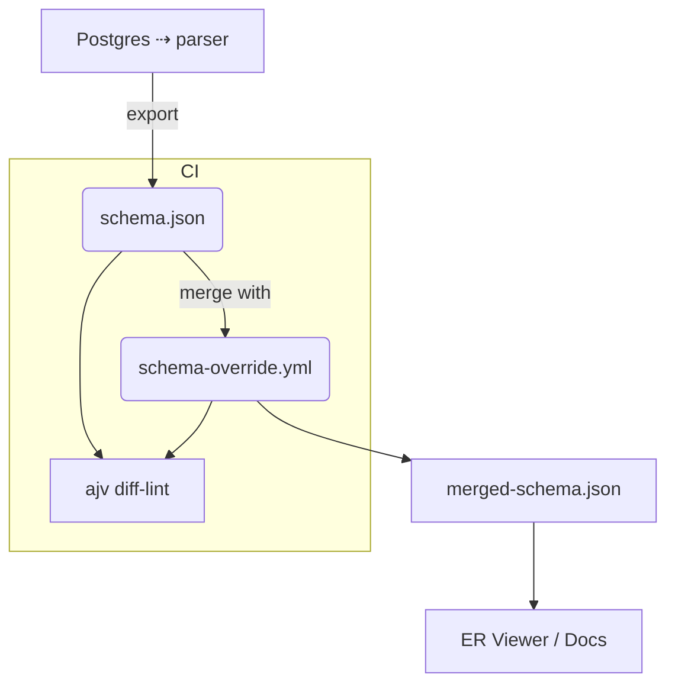

# Schema‑Override & Physical Schema Specifications (Draft)

> **Status:** Draft — v0.3 (2025‑05‑01)
> 
> This document captures **both** the *schema‑override* layer and the baseline *physical schema (schema.json)* format used in the **Liam** ecosystem.
>
> **New in v0.3** — proposal for **Implementation Requests**: a lightweight, commit‑traceable TODO mechanism embedded inside `schema‑override.yml`.

---

## 1  Purpose

The *schema‑override* mechanism allows contributors to attach rich, contextual metadata to an **existing** database schema.  
It is deliberately **non‑destructive**: **no migration or runtime behaviour** is affected.

The companion *schema.json* format standardises how the physical schema is exported so that

* override validation can cross‑check against reality (CI lint)
* downstream tools (ER viewer, diff, lineage) can consume a single canonical structure.

The new **Implementation Request** block serves as a *living TODO list* that is tightly coupled with the ER diagram and version control history.

---

## 2  Scope

| Covered by this spec                        | Out of scope                                          |
|--------------------------------------------|-------------------------------------------------------|
| Table & column comments, logical groupings | SQL migrations, constraints, indexes tuning          |
| Ad‑hoc relations not present in FK metadata| RLS / policy definitions, performance hints          |
| Physical schema baseline (tables, columns) | Runtime‑specific metadata (Row counts, statistics)    |
| Adding new tables and relationships        | Actual database schema changes                       |
| Adding new columns to existing tables      | Database migrations                                  |

---

## 3  Workflow Overview (high‑level)



---

## 4  Logical Override Layer — `schema-override.yml`

The schema override layer allows for enhancing the physical schema with additional metadata and virtual elements without modifying the actual database.

### 4.1 Structure and Components

The `schema-override.yml` file consists of two main sections:

1. **overrides**: Contains enhancements to the existing schema
2. **requests**: Contains proposed changes for future implementation

### 4.2 Example Schema Override

```yaml
overrides:
  # Table groups (logical modules)
  tableGroups:
    payments:
      name: "Payments & Refunds"
      tables: [invoice, refund]
      comment: "All financial transaction tables"

  # Table‑level overrides
  tables:
    invoice:
      comment: "Issued bill for a customer order"
      columns:
        external_id:
          comment: "Reference from the billing gateway"
      # Add new columns to existing tables
      addColumns:
        created_at:
          name: "created_at"
          type: "timestamp"
          default: "now()"
          check: null
          primary: false
          unique: false
          notNull: true
          comment: "Creation timestamp"

  # Add completely new tables
  addTables:
    posts:
      name: "posts"
      comment: "Blog posts"
      columns:
        id:
          name: "id"
          type: "uuid"
          default: null
          check: null
          primary: true
          unique: true
          notNull: true
          comment: "Primary key"
        title:
          name: "title"
          type: "varchar"
          default: null
          check: null
          primary: false
          unique: false
          notNull: true
          comment: "Post title"
      indexes: {}
      constraints: {}

  # Add new relationships
  addRelationships:
    posts_users_fk:
      name: "posts_users_fk"
      primaryTableName: "users"
      primaryColumnName: "id"
      foreignTableName: "posts"
      foreignColumnName: "user_id"
      cardinality: "ONE_TO_MANY"
      updateConstraint: "CASCADE"
      deleteConstraint: "CASCADE"
```

### 4.3 Schema Override Features

The schema override mechanism provides several key features:

1. **Table Groups**: Organize tables into logical groups for better visualization and documentation.
2. **Table & Column Comments**: Add or override comments on existing tables and columns.
3. **Add New Tables**: Define completely new tables that don't exist in the actual schema.
4. **Add New Columns**: Add new columns to existing tables.
5. **Add New Relationships**: Define relationships between tables that aren't represented by foreign keys in the database.

These features allow for enhanced documentation and visualization without affecting the actual database schema.

### 4.4 JSON Schema for Overrides (`schema-override.schema.json`)

```jsonc
{
  "$schema": "http://json-schema.org/draft-07/schema#",
  "title": "Schema Override",
  "type": "object",
  "additionalProperties": false,
  "properties": {
    "overrides": {
      "type": "object",
      "additionalProperties": false,
      "properties": {
        "tableGroups": {
          "type": "object",
          "additionalProperties": {
            "type": "object",
            "required": ["name", "tables"],
            "additionalProperties": false,
            "properties": {
              "name": { "type": "string" },
              "tables": {
                "type": "array",
                "items": { "type": "string" },
                "minItems": 1
              },
              "comment": { "type": "string" }
            }
          }
        },
        "tables": {
          "type": "object",
          "additionalProperties": {
            "type": "object",
            "additionalProperties": false,
            "properties": {
              "comment": { "type": "string" },
              "columns": {
                "type": "object",
                "additionalProperties": {
                  "type": "object",
                  "additionalProperties": false,
                  "properties": {
                    "comment": { "type": "string" }
                  }
                }
              },
              "addColumns": {
                "type": "object",
                "additionalProperties": {
                  "type": "object",
                  "required": ["name", "type", "primary", "unique", "notNull"],
                  "additionalProperties": false,
                  "properties": {
                    "name": { "type": "string" },
                    "type": { "type": "string" },
                    "default": { "type": ["string", "number", "boolean", "null"] },
                    "check": { "type": ["string", "null"] },
                    "primary": { "type": "boolean" },
                    "unique": { "type": "boolean" },
                    "notNull": { "type": "boolean" },
                    "comment": { "type": ["string", "null"] }
                  }
                }
              }
            }
          }
        },
        "addTables": {
          "type": "object",
          "additionalProperties": {
            "type": "object",
            "required": ["name", "columns"],
            "additionalProperties": false,
            "properties": {
              "name": { "type": "string" },
              "comment": { "type": ["string", "null"] },
              "columns": {
                "type": "object",
                "additionalProperties": {
                  "type": "object",
                  "required": ["name", "type", "primary", "unique", "notNull"],
                  "additionalProperties": false,
                  "properties": {
                    "name": { "type": "string" },
                    "type": { "type": "string" },
                    "default": { "type": ["string", "number", "boolean", "null"] },
                    "check": { "type": ["string", "null"] },
                    "primary": { "type": "boolean" },
                    "unique": { "type": "boolean" },
                    "notNull": { "type": "boolean" },
                    "comment": { "type": ["string", "null"] }
                  }
                }
              },
              "indexes": {
                "type": "object",
                "additionalProperties": {
                  "type": "object",
                  "required": ["name", "columns"],
                  "properties": {
                    "name": { "type": "string" },
                    "columns": { "type": "array", "items": { "type": "string" } },
                    "unique": { "type": "boolean" }
                  }
                }
              },
              "constraints": {
                "type": "object",
                "additionalProperties": {
                  "type": "object",
                  "required": ["type"],
                  "properties": {
                    "type": { "type": "string", "enum": ["PRIMARY KEY", "FOREIGN KEY", "UNIQUE", "CHECK"] },
                    "name": { "type": "string" },
                    "columnName": { "type": "string" },
                    "targetTableName": { "type": "string" },
                    "targetColumnName": { "type": "string" },
                    "updateConstraint": { "type": "string", "enum": ["CASCADE", "RESTRICT", "SET_NULL", "SET_DEFAULT", "NO_ACTION"] },
                    "deleteConstraint": { "type": "string", "enum": ["CASCADE", "RESTRICT", "SET_NULL", "SET_DEFAULT", "NO_ACTION"] },
                    "detail": { "type": "string" }
                  }
                }
              }
            }
          }
        },
        "addRelationships": {
          "type": "object",
          "additionalProperties": {
            "type": "object",
            "required": [
              "name",
              "primaryTableName",
              "primaryColumnName",
              "foreignTableName",
              "foreignColumnName",
              "cardinality",
              "updateConstraint",
              "deleteConstraint"
            ],
            "additionalProperties": false,
            "properties": {
              "name": { "type": "string" },
              "primaryTableName": { "type": "string" },
              "primaryColumnName": { "type": "string" },
              "foreignTableName": { "type": "string" },
              "foreignColumnName": { "type": "string" },
              "cardinality": {
                "type": "string",
                "enum": ["ONE_TO_ONE", "ONE_TO_MANY"]
              },
              "updateConstraint": {
                "type": "string",
                "enum": ["CASCADE", "RESTRICT", "SET_NULL", "SET_DEFAULT", "NO_ACTION"]
              },
              "deleteConstraint": {
                "type": "string",
                "enum": ["CASCADE", "RESTRICT", "SET_NULL", "SET_DEFAULT", "NO_ACTION"]
              }
            }
          }
        }
      }
    },
    "requests": {
      "type": "array",
      "items": {
        "type": "object",
        "required": ["id", "status", "createdBy", "createdAt"],
        "properties": {
          "id": {
            "type": "string",
            "pattern": "^REQ-\\d{4}-\\d{2}-\\d{2}-\\d{3}$"
          },
          "description": { "type": "string" },
          "status": {
            "type": "string",
            "enum": ["open", "in_progress", "done", "wontfix"]
          },
          "tables": {
            "type": "object",
            "properties": {
              "add": {
                "type": "object",
                "additionalProperties": {
                  "type": "object",
                  "required": ["definition"],
                  "properties": {
                    "definition": {
                      "type": "object",
                      "required": ["name", "columns"],
                      "properties": {
                        "name": { "type": "string" },
                        "comment": { "type": ["string", "null"] },
                        "columns": {
                          "type": "object",
                          "additionalProperties": {
                            "type": "object",
                            "required": ["name", "type", "primary", "unique", "notNull"],
                            "properties": {
                              "name": { "type": "string" },
                              "type": { "type": "string" },
                              "default": { "type": ["string", "number", "boolean", "null"] },
                              "check": { "type": ["string", "null"] },
                              "primary": { "type": "boolean" },
                              "unique": { "type": "boolean" },
                              "notNull": { "type": "boolean" },
                              "comment": { "type": ["string", "null"] }
                            }
                          }
                        },
                        "indexes": {
                          "type": "object",
                          "additionalProperties": {
                            "type": "object",
                            "required": ["name", "columns"],
                            "properties": {
                              "name": { "type": "string" },
                              "columns": { "type": "array", "items": { "type": "string" } },
                              "unique": { "type": "boolean" }
                            }
                          }
                        },
                        "constraints": {
                          "type": "object",
                          "additionalProperties": {
                            "type": "object",
                            "required": ["type"],
                            "properties": {
                              "type": { "type": "string", "enum": ["PRIMARY KEY", "FOREIGN KEY", "UNIQUE", "CHECK"] },
                              "name": { "type": "string" },
                              "columnName": { "type": "string" },
                              "targetTableName": { "type": "string" },
                              "targetColumnName": { "type": "string" },
                              "updateConstraint": { "type": "string", "enum": ["CASCADE", "RESTRICT", "SET_NULL", "SET_DEFAULT", "NO_ACTION"] },
                              "deleteConstraint": { "type": "string", "enum": ["CASCADE", "RESTRICT", "SET_NULL", "SET_DEFAULT", "NO_ACTION"] },
                              "detail": { "type": "string" }
                            }
                          }
                        }
                      }
                    }
                  }
                }
              },
              "drop": {
                "type": "object",
                "additionalProperties": {
                  "type": "object",
                  "required": ["reason"],
                  "properties": {
                    "reason": { "type": "string" }
                  }
                }
              },
              "alter": {
                "type": "object",
                "additionalProperties": {
                  "type": "object",
                  "required": ["changes"],
                  "properties": {
                    "changes": {
                      "type": "array",
                      "items": {
                        "type": "object",
                        "required": ["type"],
                        "properties": {
                          "type": { 
                            "type": "string", 
                            "enum": ["rename_column", "modify_column", "add_column", "drop_column"] 
                          },
                          "from": { "type": "string" },
                          "to": { "type": "string" },
                          "column": { "type": "string" },
                          "changes": {
                            "type": "object",
                            "additionalProperties": {
                              "type": "object",
                              "properties": {
                                "from": { "type": ["string", "number", "boolean", "null"] },
                                "to": { "type": ["string", "number", "boolean", "null"] }
                              }
                            }
                          },
                          "definition": {
                            "type": "object",
                            "properties": {
                              "name": { "type": "string" },
                              "type": { "type": "string" },
                              "default": { "type": ["string", "number", "boolean", "null"] },
                              "check": { "type": ["string", "null"] },
                              "primary": { "type": "boolean" },
                              "unique": { "type": "boolean" },
                              "notNull": { "type": "boolean" },
                              "comment": { "type": ["string", "null"] }
                            }
                          },
                          "name": { "type": "string" },
                          "reason": { "type": "string" }
                        }
                      }
                    }
                  }
                }
              }
            }
          },
          "relationships": {
            "type": "object",
            "properties": {
              "add": {
                "type": "object",
                "additionalProperties": {
                  "type": "object",
                  "required": ["definition"],
                  "properties": {
                    "definition": {
                      "type": "object",
                      "required": [
                        "name",
                        "primaryTableName",
                        "primaryColumnName",
                        "foreignTableName",
                        "foreignColumnName",
                        "cardinality",
                        "updateConstraint",
                        "deleteConstraint"
                      ],
                      "properties": {
                        "name": { "type": "string" },
                        "primaryTableName": { "type": "string" },
                        "primaryColumnName": { "type": "string" },
                        "foreignTableName": { "type": "string" },
                        "foreignColumnName": { "type": "string" },
                        "cardinality": {
                          "type": "string",
                          "enum": ["ONE_TO_ONE", "ONE_TO_MANY"]
                        },
                        "updateConstraint": {
                          "type": "string",
                          "enum": ["CASCADE", "RESTRICT", "SET_NULL", "SET_DEFAULT", "NO_ACTION"]
                        },
                        "deleteConstraint": {
                          "type": "string",
                          "enum": ["CASCADE", "RESTRICT", "SET_NULL", "SET_DEFAULT", "NO_ACTION"]
                        }
                      }
                    }
                  }
                }
              },
              "drop": {
                "type": "object",
                "additionalProperties": {
                  "type": "object",
                  "required": ["reason"],
                  "properties": {
                    "reason": { "type": "string" }
                  }
                }
              }
            }
          },
          "createdBy": { "type": "string" },
          "createdAt": { "type": "string", "format": "date-time" },
          "refs": {
            "type": "object",
            "properties": {
              "issue": { "type": ["string", "number"] },
              "commit": { "type": ["string", "null"] }
            }
          }
        }
      }
    }
  }
}
```

---

## 5  Physical Schema Baseline — `schema.json`

The physical schema baseline represents the actual database structure as exported by the parser.

### 5.1 Structure and Components

The `schema.json` file contains the following main components:

1. **database**: Information about the database system
2. **tables**: Array of table definitions with columns, indexes, and foreign keys

### 5.2 Example Schema

```jsonc
{
  "database": {
    "vendor": "postgres",
    "version": "15.5"
  },
  "tables": [
    {
      "name": "invoice",
      "schema": "public",
      "columns": [
        { "name": "id", "type": "uuid", "nullable": false, "primaryKey": true },
        { "name": "external_id", "type": "text", "nullable": true },
        { "name": "amount", "type": "numeric", "nullable": false, "default": "0" }
      ],
      "indexes": [
        { "name": "invoice_external_id_idx", "columns": ["external_id"], "unique": true }
      ],
      "foreignKeys": [
        {
          "name": "invoice_order_id_fkey",
          "columns": ["order_id"],
          "references": {
            "table": "order",
            "columns": ["id"],
            "onUpdate": "CASCADE",
            "onDelete": "RESTRICT"
          }
        }
      ]
    }
  ]
}
```

### 5.3 JSON Schema for Physical Schema (`schema.schema.json`)

```jsonc
{
  "$schema": "http://json-schema.org/draft-07/schema#",
  "title": "Physical Database Schema",
  "type": "object",
  "required": ["database", "tables"],
  "additionalProperties": false,
  "properties": {
    "database": {
      "type": "object",
      "required": ["vendor", "version"],
      "additionalProperties": false,
      "properties": {
        "vendor": { "type": "string", "enum": ["postgres", "mysql", "sqlite", "sqlserver"] },
        "version": { "type": "string" }
      }
    },
    "tables": {
      "type": "array",
      "minItems": 1,
      "items": {
        "type": "object",
        "required": ["name", "columns"],
        "additionalProperties": false,
        "properties": {
          "name": { "type": "string" },
          "schema": { "type": "string" },
          "columns": {
            "type": "array",
            "items": {
              "type": "object",
              "required": ["name", "type"],
              "additionalProperties": false,
              "properties": {
                "name": { "type": "string" },
                "type": { "type": "string" },
                "nullable": { "type": "boolean" },
                "primaryKey": { "type": "boolean" },
                "default": { "type": ["string", "number", "null"] },
                "comment": { "type": "string" }
              }
            }
          },
          "indexes": {
            "type": "array",
            "items": {
              "type": "object",
              "required": ["name", "columns"],
              "additionalProperties": false,
              "properties": {
                "name": { "type": "string" },
                "columns": { "type": "array", "items": { "type": "string" } },
                "unique": { "type": "boolean" }
              }
            }
          },
          "foreignKeys": {
            "type": "array",
            "items": {
              "type": "object",
              "required": ["columns", "references"],
              "additionalProperties": false,
              "properties": {
                "name": { "type": "string" },
                "columns": { "type": "array", "items": { "type": "string" } },
                "references": {
                  "type": "object",
                  "required": ["table", "columns"],
                  "additionalProperties": false,
                  "properties": {
                    "table": { "type": "string" },
                    "columns": { "type": "array", "items": { "type": "string" } },
                    "onUpdate": { "type": "string" },
                    "onDelete": { "type": "string" }
                  }
                }
              }
            }
          }
        }
      }
    }
  }
}
```

> **Note:** Indexes, triggers, and constraints beyond FKs are optional at v0.3. Future drafts may extend support.

### 5.4 Schema Integration

The physical schema (`schema.json`) and the logical override layer (`schema-override.yml`) are integrated as follows:

1. The parser exports the physical schema from the database as `schema.json`
2. The `schema-override.yml` file provides additional metadata and virtual elements
3. The integration process merges these two sources:
   - Comments from the override layer are applied to existing tables and columns
   - Table groups are created based on the override definitions
   - Virtual tables and relationships are added to the merged schema
   - Implementation requests are processed according to their status

This integration allows for enhanced documentation and visualization without affecting the actual database schema.

---

## 6  Next Steps

1. Improve validation for schema overrides to ensure they don't conflict with existing schema.
2. Enhance visualization of added tables and relationships in the ER diagram.
3. Add support for more complex column types and constraints.

---

## 7  Implementation Requests

The *Implementation Requests* feature provides a structured way to propose, track, and implement schema changes over time. It serves as a living TODO list that is tightly coupled with version control and the ER diagram.

### 7.1  Purpose

Implementation Requests allow contributors to:

* Document proposed schema changes directly alongside the schema definition
* Track the status of requested changes through the implementation lifecycle
* Maintain a clear history of schema evolution decisions
* Link schema changes to issues, commits, and pull requests

### 7.2  Structure

Implementation Requests are defined in the `requests` section of the `schema-override.yml` file:

```yaml
# Current schema overrides
overrides:
  # existing overrides...

# Implementation requests for future changes
requests:
  - id: "REQ-2025-05-01-001"
    description: "Add comment functionality"
    status: "open"  # open, in_progress, done, wontfix
    tables:
      add:
        comments:
          definition:
            name: "comments"
            columns:
              id: 
                name: "id"
                type: "uuid"
                default: null
                check: null
                primary: true
                unique: true
                notNull: true
                comment: "Primary key"
              post_id:
                name: "post_id"
                type: "uuid"
                default: null
                check: null
                primary: false
                unique: false
                notNull: true
                comment: "Foreign key to posts table"
              content:
                name: "content"
                type: "text"
                default: null
                check: null
                primary: false
                unique: false
                notNull: true
                comment: "Comment content"
              created_at:
                name: "created_at"
                type: "timestamp"
                default: "now()"
                check: null
                primary: false
                unique: false
                notNull: true
                comment: "Creation timestamp"
            indexes: {}
            constraints: {}
    relationships:
      add:
        comments_posts_fk:
          definition:
            name: "comments_posts_fk"
            primaryTableName: "posts"
            primaryColumnName: "id"
            foreignTableName: "comments"
            foreignColumnName: "post_id"
            cardinality: "ONE_TO_MANY"
            updateConstraint: "CASCADE"
            deleteConstraint: "CASCADE"
    createdBy: "hoshinotsuyoshi"
    createdAt: "2025-05-01T06:45:00Z"
    refs:
      issue: "123"
      commit: null
```

### 7.3  Request Types

Implementation Requests support various operation types:

#### 7.3.1  Table Operations

* **Add Table**: Define a new table to be created
  ```yaml
  tables:
    add:
      new_table_name:
        definition:
          # table definition
  ```

* **Drop Table**: Request removal of an existing table
  ```yaml
  tables:
    drop:
      table_to_remove:
        reason: "This table is no longer needed because..."
  ```

* **Alter Table**: Request changes to an existing table
  ```yaml
  tables:
    alter:
      existing_table:
        changes:
          - type: "rename_column"
            from: "old_name"
            to: "new_name"
            reason: "Standardizing naming conventions"
          
          - type: "modify_column"
            column: "column_name"
            changes:
              type: 
                from: "varchar(100)"
                to: "varchar(255)"
              notNull:
                from: false
                to: true
            reason: "Supporting longer values and ensuring data integrity"
          
          - type: "add_column"
            definition:
              name: "new_column"
              type: "timestamp"
              default: null
              notNull: false
              comment: "New feature data"
            reason: "Supporting new feature X"
          
          - type: "drop_column"
            name: "obsolete_column"
            reason: "No longer used after feature Y was removed"
  ```

#### 7.3.2  Relationship Operations

* **Add Relationship**: Define a new relationship between tables
  ```yaml
  relationships:
    add:
      new_relationship_name:
        definition:
          # relationship definition
  ```

* **Drop Relationship**: Request removal of a relationship
  ```yaml
  relationships:
    drop:
      relationship_to_remove:
        reason: "This relationship is no longer valid because..."
  ```

#### 7.3.3  Other Operations

Similar patterns can be applied to other schema elements:

* **Indexes**: `indexes.add`, `indexes.drop`, `indexes.alter`
* **Constraints**: `constraints.add`, `constraints.drop`, `constraints.alter`

### 7.4  Request Lifecycle

| Status | Description | Visualization |
|--------|-------------|---------------|
| `open` | Proposed change that hasn't been implemented | Displayed with "TODO" badge in ER diagram |
| `in_progress` | Change is being implemented | Displayed with "In Progress" badge |
| `done` | Change has been implemented | No badge, change is reflected in schema |
| `wontfix` | Change was rejected or is no longer needed | Not displayed |

### 7.5  CI Integration

Implementation Requests can be integrated with CI pipelines:

1. **Validation**: Ensure requests follow the correct format
2. **Status Tracking**: Automatically update request status based on commits
3. **Consistency Checks**: Verify that `done` requests match actual schema changes
4. **Stale Request Detection**: Flag `in_progress` requests that haven't been updated

### 7.6  Complete Schema Example

Below is a complete example of a `schema-override.yml` file that includes both overrides and implementation requests:

```yaml
# Schema overrides for existing database
overrides:
  # Table groups for logical organization
  tableGroups:
    GitHub:
      name: "GitHub Integration"
      tables:
        - github_repositories
        - github_pull_requests
        - github_pull_request_comments
      comment: "Tables related to GitHub integration"
    
    Organization:
      name: "Organization Management"
      tables:
        - organizations
        - organization_members
        - users
      comment: "Tables for managing organizations and users"
  
  # Table-level overrides
  tables:
    github_repositories:
      comment: "GitHub repositories with metadata"
      columns:
        github_repository_identifier:
          comment: "GitHub's repository ID from their API"
    
    users:
      comment: "User accounts and authentication information"
      columns:
        email:
          comment: "Primary email address for notifications"
        created_at:
          comment: "Account creation timestamp"
      
      # Add new columns to existing tables
      addColumns:
        last_login:
          name: "last_login"
          type: "timestamp"
          default: null
          check: null
          primary: false
          unique: false
          notNull: false
          comment: "Last successful login timestamp"
  
  # Add completely new tables
  addTables:
    documentation:
      name: "documentation"
      comment: "Documentation resources for repositories"
      columns:
        id:
          name: "id"
          type: "uuid"
          default: null
          check: null
          primary: true
          unique: true
          notNull: true
          comment: "Primary key"
        repository_id:
          name: "repository_id"
          type: "uuid"
          default: null
          check: null
          primary: false
          unique: false
          notNull: true
          comment: "Foreign key to github_repositories"
        title:
          name: "title"
          type: "varchar"
          default: null
          check: null
          primary: false
          unique: false
          notNull: true
          comment: "Documentation title"
        content:
          name: "content"
          type: "text"
          default: null
          check: null
          primary: false
          unique: false
          notNull: true
          comment: "Documentation content"
      indexes: {}
      constraints: {}
  
  # Add new relationships
  addRelationships:
    documentation_repository_fk:
      name: "documentation_repository_fk"
      primaryTableName: "github_repositories"
      primaryColumnName: "id"
      foreignTableName: "documentation"
      foreignColumnName: "repository_id"
      cardinality: "ONE_TO_MANY"
      updateConstraint: "CASCADE"
      deleteConstraint: "CASCADE"

# Implementation requests for future changes
requests:
  - id: "REQ-2025-05-01-001"
    description: "Add analytics tracking for repositories"
    status: "open"
    tables:
      add:
        repository_analytics:
          definition:
            name: "repository_analytics"
            columns:
              id:
                name: "id"
                type: "uuid"
                default: null
                check: null
                primary: true
                unique: true
                notNull: true
                comment: "Primary key"
              repository_id:
                name: "repository_id"
                type: "uuid"
                default: null
                check: null
                primary: false
                unique: false
                notNull: true
                comment: "Foreign key to github_repositories"
              views_count:
                name: "views_count"
                type: "integer"
                default: "0"
                check: null
                primary: false
                unique: false
                notNull: true
                comment: "Number of repository views"
              clones_count:
                name: "clones_count"
                type: "integer"
                default: "0"
                check: null
                primary: false
                unique: false
                notNull: true
                comment: "Number of repository clones"
              last_updated:
                name: "last_updated"
                type: "timestamp"
                default: "now()"
                check: null
                primary: false
                unique: false
                notNull: true
                comment: "Last update timestamp"
            indexes: {}
            constraints: {}
    relationships:
      add:
        analytics_repository_fk:
          definition:
            name: "analytics_repository_fk"
            primaryTableName: "github_repositories"
            primaryColumnName: "id"
            foreignTableName: "repository_analytics"
            foreignColumnName: "repository_id"
            cardinality: "ONE_TO_ONE"
            updateConstraint: "CASCADE"
            deleteConstraint: "CASCADE"
    createdBy: "hoshinotsuyoshi"
    createdAt: "2025-05-01T06:50:00Z"
    refs:
      issue: "456"
      commit: null

  - id: "REQ-2025-05-01-002"
    description: "Improve user table with additional fields"
    status: "in_progress"
    tables:
      alter:
        users:
          changes:
            - type: "add_column"
              definition:
                name: "last_login"
                type: "timestamp"
                default: null
                notNull: false
                comment: "User's last login timestamp"
              reason: "Track user activity for security monitoring"
            
            - type: "add_column"
              definition:
                name: "login_count"
                type: "integer"
                default: "0"
                notNull: true
                comment: "Number of times user has logged in"
              reason: "Track user engagement metrics"
            
            - type: "modify_column"
              column: "email"
              changes:
                type:
                  from: "varchar(100)"
                  to: "varchar(255)"
              reason: "Support longer email addresses"
    createdBy: "hoshinotsuyoshi"
    createdAt: "2025-05-01T06:51:00Z"
    refs:
      issue: "457"
      commit: null

  - id: "REQ-2025-05-01-003"
    description: "Remove legacy notification system"
    status: "open"
    tables:
      drop:
        legacy_notifications:
          reason: "This table is no longer needed as we've migrated to the new notification system"
    relationships:
      drop:
        legacy_notification_user_fk:
          reason: "Relationship is no longer needed as the legacy_notifications table will be removed"
    createdBy: "hoshinotsuyoshi"
    createdAt: "2025-05-01T06:52:00Z"
    refs:
      issue: "458"
      commit: null
```

---

*End of Draft v0.3*
