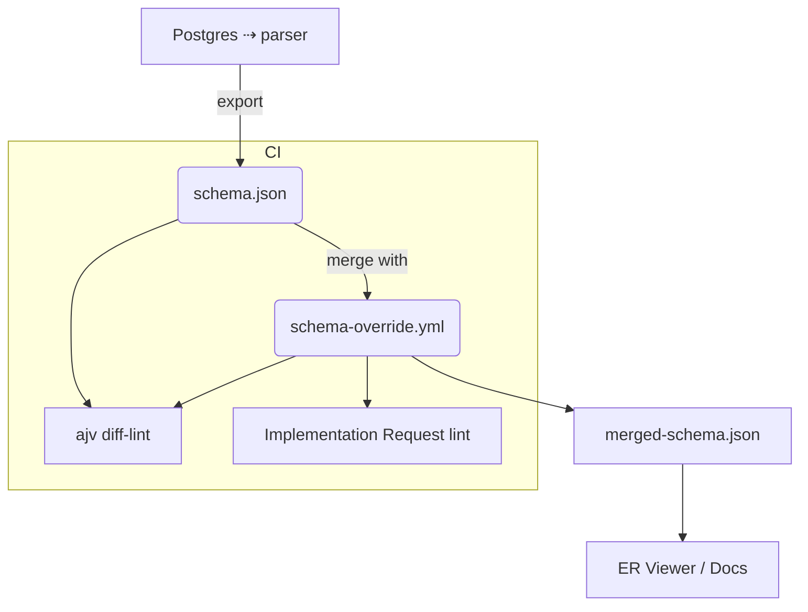

# Schema‑Override & Physical Schema Specifications (Draft)

> **Status:** Draft — v0.3 (2025‑04‑30)
> 
> This document captures **both** the *schema‑override* layer and the baseline *physical schema (schema.json)* format used in the **Liam** ecosystem.
>
> **New in v0.3** — proposal for **Implementation Requests**: a lightweight, commit‑traceable TODO mechanism embedded inside `schema‑override.yml`.

---

## 1  Purpose

The *schema‑override* mechanism allows contributors to attach rich, contextual metadata to an **existing** database schema.  
It is deliberately **non‑destructive**: **no migration or runtime behaviour** is affected.

The companion *schema.json* format standardises how the physical schema is exported so that

* override validation can cross‑check against reality (CI lint)
* downstream tools (ER viewer, diff, lineage) can consume a single canonical structure.

The new **Implementation Request** block serves as a *living TODO list* that is tightly coupled with the ER diagram and version control history.

---

## 2  Scope

| Covered by this spec                        | Out of scope                                          |
|--------------------------------------------|-------------------------------------------------------|
| Table & column comments, logical groupings | SQL migrations, constraints, indexes tuning          |
| Ad‑hoc relations not present in FK metadata| RLS / policy definitions, performance hints          |
| Physical schema baseline (tables, columns) | Runtime‑specific metadata (Row counts, statistics)    |
| **Implementation Requests (proposed)**     | Full project management tooling                       |

---

## 3  Workflow Overview (high‑level)


```mermaid
flowchart TD
  A[Postgres ⇢ parser] -->|export| B(schema.json)
  B -->|merge with| C(schema‑override.yml)
  C --> D[merged‑schema.json]
  D --> E[ER Viewer / Docs]
  subgraph CI
    B --> F[ajv diff‑lint]
    C --> F
    C --> G[Implementation Request lint]
  end
```

---

## 4  Logical Override Layer — `schema-override.yml`

```yaml
version: "0.2"

# 4.1 Table groups (logical modules)
tableGroups:
  payments:
    title: "Payments & Refunds"
    description: "All financial transaction tables"
    tables: [invoice, refund]

# 4.2 Table‑level overrides
tables:
  invoice:
    displayName: "Invoice"
    comment: "Issued bill for a customer order"
    columns:
      external_id:
        displayName: "External ID"
        description: "Reference from the billing gateway"
      amount:
        classification: personal_data

# 4.3 Extra relations (not in physical FK)
relations:
  - source: invoice.external_id
    target: external_invoices.id
    description: "Soft link to external billing records"

# 4.4 Implementation Requests (NEW)
implementationRequests:
  - id: "REQ-2025-04-30-001"
    title: "Add index on invoice.created_at"
    description: |
      Bulk export queries are slow (>1 s).  
      Create an index to optimise ORDER BY created_at.
    status: open            # open | in_progress | done | wontfix
    target:
      action: add_index     # declarative hint for future migration tooling
      table: invoice
      columns: [created_at]
    createdBy: hoppiestar
    createdAt: "2025-04-30T08:35:00Z"
    refs:
      commit: "a3c9d52"
      issue: 1520
```

### 4.5 Discussion

*Developers* can raise a TODO directly next to the affected table/column. Because it lives in Git:

* every change is diff‑able & reviewable,
* commits/PRs can close the request by flipping `status` to `done`,
* CI can fail if `status = open` but corresponding change exists in `schema.json`.

---

### 4.6 JSON Schema for Overrides (`schema-override.schema.json`)

```jsonc
{
  "$schema": "http://json-schema.org/draft-07/schema#",
  "title": "Schema Override",
  "type": "object",
  "required": ["version"],
  "additionalProperties": false,
  "properties": {
    "version": {
      "type": "string",
      "pattern": "^\\d+\\.\\d+(\\.\\d+)?$"
    },
    "tableGroups": { "$ref": "#/definitions/tableGroups" },
    "tables": { "$ref": "#/definitions/tables" },
    "relations": { "$ref": "#/definitions/relations" },
    "implementationRequests": {
      "type": "array",
      "items": { "$ref": "#/definitions/implementationRequest" }
    }
  },
  "definitions": {
    "tableGroups": {
      "type": "object",
      "additionalProperties": {
        "type": "object",
        "required": ["tables"],
        "additionalProperties": false,
        "properties": {
          "title": { "type": "string" },
          "description": { "type": "string" },
          "tables": {
            "type": "array",
            "items": { "type": "string" },
            "minItems": 1
          }
        }
      }
    },
    "tables": {
      "type": "object",
      "additionalProperties": { "$ref": "#/definitions/tableOverride" }
    },
    "tableOverride": {
      "type": "object",
      "additionalProperties": false,
      "properties": {
        "displayName": { "type": "string" },
        "comment": { "type": "string" },
        "columns": {
          "type": "object",
          "additionalProperties": {
            "type": "object",
            "additionalProperties": false,
            "properties": {
              "displayName": { "type": "string" },
              "description": { "type": "string" },
              "classification": {
                "type": "string",
                "enum": ["personal_data", "sensitive", "public", "internal"]
              }
            }
          }
        }
      }
    },
    "relations": {
      "type": "array",
      "items": {
        "type": "object",
        "required": ["source", "target"],
        "additionalProperties": false,
        "properties": {
          "source": {
            "type": "string",
            "pattern": "^[A-Za-z0-9_]+\\.[A-Za-z0-9_]+$"
          },
          "target": {
            "type": "string",
            "pattern": "^[A-Za-z0-9_]+\\.[A-Za-z0-9_]+$"
          },
          "description": { "type": "string" }
        }
      }
    },
    "implementationRequest": {
      "type": "object",
      "required": ["title", "status", "target"],
      "additionalProperties": false,
      "properties": {
        "id": { "type": "string" },
        "title": { "type": "string" },
        "description": { "type": "string" },
        "status": {
          "type": "string",
          "enum": ["open", "in_progress", "done", "wontfix"]
        },
        "target": {
          "type": "object",
          "required": ["action", "table"],
          "additionalProperties": false,
          "properties": {
            "action": {
              "type": "string",
              "enum": [
                "add_column", "drop_column", "alter_column", "add_index", "drop_index", "add_constraint", "drop_constraint"
              ]
            },
            "table": { "type": "string" },
            "columns": { "type": "array", "items": { "type": "string" } }
          }
        },
        "createdBy": { "type": "string" },
        "createdAt": { "type": "string", "format": "date-time" },
        "refs": {
          "type": "object",
          "additionalProperties": false,
          "properties": {
            "commit": {
              "type": "string",
              "pattern": "^[0-9a-f]{7,40}$"
            },
            "issue": { "type": "integer" }
          }
        }
      }
    }
  }
}
```

---

## 5  Physical Schema Baseline — `schema.json`

*(unchanged from v0.2 — see previous section)*

---

## 6  Implementation Request Lifecycle

| Phase | Trigger | CI / Tooling behaviour |
|-------|---------|------------------------|
| **Open** | `status: open` in PR | Docs viewer surfaces TODO badge; CI passes but warns |
| **In Progress** | Developer sets `status: in_progress` | Optional: block merge if unchanged for > N days |
| **Done** | Actual migration merged **and** status → `done` | CI asserts diff between `schema.json` & request target; closes if matched |
| **Wontfix** | Decision not to implement | CI ignores request |

---

## 7  Next Steps

1. Review enum list for `action` — align with migration DSL.  
2. Prototype CI script that flags `implementationRequests.status = open` but matching change exists in `schema.json`.  
3. Decide UX: update via YAML or separate `/api/tasks` endpoint + auto‑commit.

---

*End of Draft v0.3*
