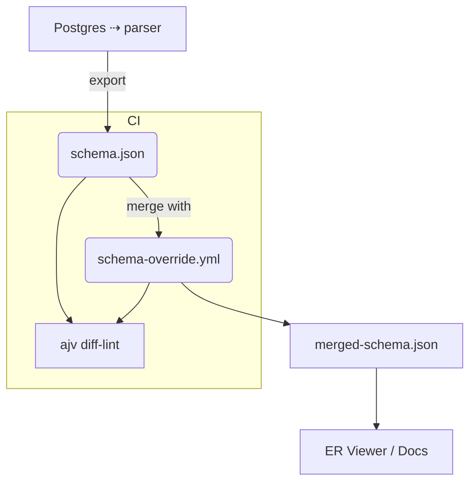

# Schema‑Override & Physical Schema Specifications (Draft)

> **Status:** Draft — v0.3 (2025‑04‑30)
> 
> This document captures **both** the *schema‑override* layer and the baseline *physical schema (schema.json)* format used in the **Liam** ecosystem.
>
> **New in v0.3** — proposal for **Implementation Requests**: a lightweight, commit‑traceable TODO mechanism embedded inside `schema‑override.yml`.

---

## 1  Purpose

The *schema‑override* mechanism allows contributors to attach rich, contextual metadata to an **existing** database schema.  
It is deliberately **non‑destructive**: **no migration or runtime behaviour** is affected.

The companion *schema.json* format standardises how the physical schema is exported so that

* override validation can cross‑check against reality (CI lint)
* downstream tools (ER viewer, diff, lineage) can consume a single canonical structure.

The new **Implementation Request** block serves as a *living TODO list* that is tightly coupled with the ER diagram and version control history.

---

## 2  Scope

| Covered by this spec                        | Out of scope                                          |
|--------------------------------------------|-------------------------------------------------------|
| Table & column comments, logical groupings | SQL migrations, constraints, indexes tuning          |
| Ad‑hoc relations not present in FK metadata| RLS / policy definitions, performance hints          |
| Physical schema baseline (tables, columns) | Runtime‑specific metadata (Row counts, statistics)    |
| Adding new tables and relationships        | Actual database schema changes                       |
| Adding new columns to existing tables      | Database migrations                                  |

---

## 3  Workflow Overview (high‑level)


```mermaid
flowchart TD
  A[Postgres ⇢ parser] -->|export| B(schema.json)
  B -->|merge with| C(schema‑override.yml)
  C --> D[merged‑schema.json]
  D --> E[ER Viewer / Docs]
  subgraph CI
    B --> F[ajv diff‑lint]
    C --> F
  end
```

---

## 4  Logical Override Layer — `schema-override.yml`

```yaml
overrides:
  # 4.1 Table groups (logical modules)
  tableGroups:
    payments:
      name: "Payments & Refunds"
      tables: [invoice, refund]
      comment: "All financial transaction tables"

  # 4.2 Table‑level overrides
  tables:
    invoice:
      comment: "Issued bill for a customer order"
      columns:
        external_id:
          comment: "Reference from the billing gateway"
      # 4.3 Add new columns to existing tables
      addColumns:
        created_at:
          name: "created_at"
          type: "timestamp"
          default: "now()"
          check: null
          primary: false
          unique: false
          notNull: true
          comment: "Creation timestamp"

  # 4.4 Add completely new tables
  addTables:
    posts:
      name: "posts"
      comment: "Blog posts"
      columns:
        id:
          name: "id"
          type: "uuid"
          default: null
          check: null
          primary: true
          unique: true
          notNull: true
          comment: "Primary key"
        title:
          name: "title"
          type: "varchar"
          default: null
          check: null
          primary: false
          unique: false
          notNull: true
          comment: "Post title"
      indexes: {}
      constraints: {}

  # 4.5 Add new relationships
  addRelationships:
    posts_users_fk:
      name: "posts_users_fk"
      primaryTableName: "users"
      primaryColumnName: "id"
      foreignTableName: "posts"
      foreignColumnName: "user_id"
      cardinality: "ONE_TO_MANY"
      updateConstraint: "CASCADE"
      deleteConstraint: "CASCADE"
```

### 4.6 Schema Override Features

The schema override mechanism provides several key features:

1. **Table Groups**: Organize tables into logical groups for better visualization and documentation.
2. **Table & Column Comments**: Add or override comments on existing tables and columns.
3. **Add New Tables**: Define completely new tables that don't exist in the actual schema.
4. **Add New Columns**: Add new columns to existing tables.
5. **Add New Relationships**: Define relationships between tables that aren't represented by foreign keys in the database.

These features allow for enhanced documentation and visualization without affecting the actual database schema.

---

### 4.7 JSON Schema for Overrides (`schema-override.schema.json`)

```jsonc
{
  "$schema": "http://json-schema.org/draft-07/schema#",
  "title": "Schema Override",
  "type": "object",
  "additionalProperties": false,
  "properties": {
    "overrides": {
      "type": "object",
      "additionalProperties": false,
      "properties": {
        "tableGroups": {
          "type": "object",
          "additionalProperties": {
            "type": "object",
            "required": ["name", "tables"],
            "additionalProperties": false,
            "properties": {
              "name": { "type": "string" },
              "tables": {
                "type": "array",
                "items": { "type": "string" },
                "minItems": 1
              },
              "comment": { "type": "string" }
            }
          }
        },
        "tables": {
          "type": "object",
          "additionalProperties": {
            "type": "object",
            "additionalProperties": false,
            "properties": {
              "comment": { "type": "string" },
              "columns": {
                "type": "object",
                "additionalProperties": {
                  "type": "object",
                  "additionalProperties": false,
                  "properties": {
                    "comment": { "type": "string" }
                  }
                }
              },
              "addColumns": {
                "type": "object",
                "additionalProperties": {
                  "type": "object",
                  "required": ["name", "type", "primary", "unique", "notNull"],
                  "additionalProperties": false,
                  "properties": {
                    "name": { "type": "string" },
                    "type": { "type": "string" },
                    "default": { "type": ["string", "number", "boolean", "null"] },
                    "check": { "type": ["string", "null"] },
                    "primary": { "type": "boolean" },
                    "unique": { "type": "boolean" },
                    "notNull": { "type": "boolean" },
                    "comment": { "type": ["string", "null"] }
                  }
                }
              }
            }
          }
        },
        "addTables": {
          "type": "object",
          "additionalProperties": {
            "type": "object",
            "required": ["name", "columns"],
            "additionalProperties": false,
            "properties": {
              "name": { "type": "string" },
              "comment": { "type": ["string", "null"] },
              "columns": {
                "type": "object",
                "additionalProperties": {
                  "type": "object",
                  "required": ["name", "type", "primary", "unique", "notNull"],
                  "additionalProperties": false,
                  "properties": {
                    "name": { "type": "string" },
                    "type": { "type": "string" },
                    "default": { "type": ["string", "number", "boolean", "null"] },
                    "check": { "type": ["string", "null"] },
                    "primary": { "type": "boolean" },
                    "unique": { "type": "boolean" },
                    "notNull": { "type": "boolean" },
                    "comment": { "type": ["string", "null"] }
                  }
                }
              },
              "indexes": {
                "type": "object"
              },
              "constraints": {
                "type": "object"
              }
            }
          }
        },
        "addRelationships": {
          "type": "object",
          "additionalProperties": {
            "type": "object",
            "required": [
              "name",
              "primaryTableName",
              "primaryColumnName",
              "foreignTableName",
              "foreignColumnName",
              "cardinality",
              "updateConstraint",
              "deleteConstraint"
            ],
            "additionalProperties": false,
            "properties": {
              "name": { "type": "string" },
              "primaryTableName": { "type": "string" },
              "primaryColumnName": { "type": "string" },
              "foreignTableName": { "type": "string" },
              "foreignColumnName": { "type": "string" },
              "cardinality": {
                "type": "string",
                "enum": ["ONE_TO_ONE", "ONE_TO_MANY"]
              },
              "updateConstraint": {
                "type": "string",
                "enum": ["CASCADE", "RESTRICT", "SET_NULL", "SET_DEFAULT", "NO_ACTION"]
              },
              "deleteConstraint": {
                "type": "string",
                "enum": ["CASCADE", "RESTRICT", "SET_NULL", "SET_DEFAULT", "NO_ACTION"]
              }
            }
          }
        }
      }
    }
  }
}
```

---

## 5  Physical Schema Baseline — `schema.json`

*(unchanged from v0.2 — see previous section)*

---

## 6  Next Steps

1. Improve validation for schema overrides to ensure they don't conflict with existing schema.
2. Enhance visualization of added tables and relationships in the ER diagram.
3. Add support for more complex column types and constraints.

---

*End of Draft v0.3*
