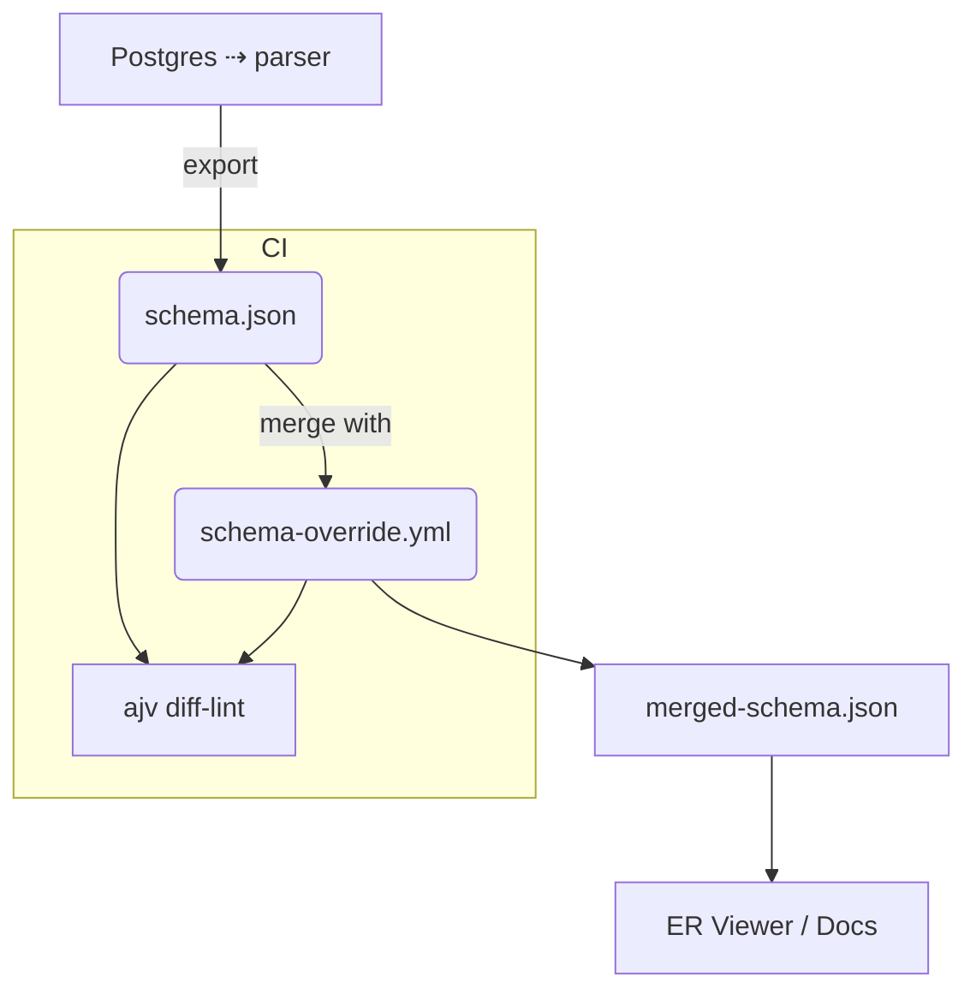

# Schema‑Override & Physical Schema Specifications (Draft)

> **Status:** Draft — v0.2 (2025‑04‑30)
> 
> This document captures **both** the *schema‑override* layer and the baseline *physical schema (schema.json)* format used in the **Liam** ecosystem.

---

## 1  Purpose

The *schema‑override* mechanism allows contributors to attach rich, contextual metadata to an **existing** database schema.  
It is deliberately **non‑destructive**: no migration or runtime behaviour is affected.

The companion *schema.json* format standardises how the physical schema is exported so that

* override validation can cross‑check against reality (CI lint)
* downstream tools (ER viewer, diff, lineage) can consume a single canonical structure.

---

## 2  Scope

| Covered by this spec                        | Out of scope                                          |
|--------------------------------------------|-------------------------------------------------------|
| Table & column comments, logical groupings | SQL migrations, constraints, indexes tuning          |
| Ad‑hoc relations not present in FK metadata| RLS / policy definitions, performance hints          |
| Physical schema baseline (tables, columns) | Runtime‑specific metadata (Row counts, statistics)    |

---

## 3  Workflow Overview (high‑level)


```mermaid
flowchart TD
  A[Postgres ⇢ parser] -->|export| B(schema.json)
  B -->|merge with| C(schema‑override.yml)
  C --> D[merged‑schema.json]
  D --> E[ER Viewer / Docs]
  subgraph CI
    B --> F[ajv diff‑lint]
    C --> F
  end
```

---

## 4  Logical Override Layer — `schema-override.yml`

```yaml
version: "0.1"

# 4.1 Table groups (logical modules)
tableGroups:
  payments:
    title: "Payments & Refunds"
    description: "All financial transaction tables"
    tables: [invoice, refund]

# 4.2 Table‑level overrides
tables:
  invoice:
    displayName: "Invoice"
    comment: "Issued bill for a customer order"
    columns:
      external_id:
        displayName: "External ID"
        description: "Reference from the billing gateway"
      amount:
        classification: personal_data

# 4.3 Extra relations (not in physical FK)
relations:
  - source: invoice.external_id
    target: external_invoices.id
    description: "Soft link to external billing records"
```

### 4.4 JSON Schema for Overrides (`schema-override.schema.json`)

```jsonc
{
  "$schema": "http://json-schema.org/draft-07/schema#",
  "title": "Schema Override",
  "type": "object",
  "required": ["version"],
  "additionalProperties": false,
  "properties": {
    "version": {
      "type": "string",
      "pattern": "^\\d+\\.\\d+(\\.\\d+)?$"
    },
    "tableGroups": {
      "type": "object",
      "additionalProperties": {
        "type": "object",
        "required": ["tables"],
        "additionalProperties": false,
        "properties": {
          "title": { "type": "string" },
          "description": { "type": "string" },
          "tables": {
            "type": "array",
            "items": { "type": "string" },
            "minItems": 1
          }
        }
      }
    },
    "tables": {
      "type": "object",
      "additionalProperties": {
        "type": "object",
        "additionalProperties": false,
        "properties": {
          "displayName": { "type": "string" },
          "comment": { "type": "string" },
          "columns": {
            "type": "object",
            "additionalProperties": {
              "type": "object",
              "additionalProperties": false,
              "properties": {
                "displayName": { "type": "string" },
                "description": { "type": "string" },
                "classification": {
                  "type": "string",
                  "enum": ["personal_data", "sensitive", "public", "internal"]
                }
              }
            }
          }
        }
      }
    },
    "relations": {
      "type": "array",
      "items": {
        "type": "object",
        "required": ["source", "target"],
        "additionalProperties": false,
        "properties": {
          "source": {
            "type": "string",
            "pattern": "^[A-Za-z0-9_]+\\.[A-Za-z0-9_]+$"
          },
          "target": {
            "type": "string",
            "pattern": "^[A-Za-z0-9_]+\\.[A-Za-z0-9_]+$"
          },
          "description": { "type": "string" }
        }
      }
    }
  }
}
```

---

## 5  Physical Schema Baseline — `schema.json`

The parser emits *schema.json* for every database dump. This canonical file represents the exact physical structure **without logical adornments**.

### 5.1 Example snippet

```jsonc
{
  "database": {
    "vendor": "postgres",
    "version": "15.5"
  },
  "tables": [
    {
      "name": "invoice",
      "schema": "public",
      "columns": [
        { "name": "id", "type": "uuid", "nullable": false, "primaryKey": true },
        { "name": "external_id", "type": "text", "nullable": true },
        { "name": "amount", "type": "numeric", "nullable": false, "default": "0" }
      ],
      "indexes": [
        { "name": "invoice_external_id_idx", "columns": ["external_id"], "unique": true }
      ],
      "foreignKeys": [
        {
          "name": "invoice_order_id_fkey",
          "columns": ["order_id"],
          "references": {
            "table": "order",
            "columns": ["id"],
            "onUpdate": "CASCADE",
            "onDelete": "RESTRICT"
          }
        }
      ]
    }
  ]
}
```

### 5.2 JSON Schema for Physical Schema (`schema.schema.json`)

```jsonc
{
  "$schema": "http://json-schema.org/draft-07/schema#",
  "title": "Physical Database Schema",
  "type": "object",
  "required": ["database", "tables"],
  "additionalProperties": false,
  "properties": {
    "database": {
      "type": "object",
      "required": ["vendor", "version"],
      "additionalProperties": false,
      "properties": {
        "vendor": { "type": "string", "enum": ["postgres", "mysql", "sqlite", "sqlserver"] },
        "version": { "type": "string" }
      }
    },
    "tables": {
      "type": "array",
      "minItems": 1,
      "items": {
        "type": "object",
        "required": ["name", "columns"],
        "additionalProperties": false,
        "properties": {
          "name": { "type": "string" },
          "schema": { "type": "string" },
          "columns": {
            "type": "array",
            "items": {
              "type": "object",
              "required": ["name", "type"],
              "additionalProperties": false,
              "properties": {
                "name": { "type": "string" },
                "type": { "type": "string" },
                "nullable": { "type": "boolean" },
                "primaryKey": { "type": "boolean" },
                "default": { "type": ["string", "number", "null"] },
                "comment": { "type": "string" }
              }
            }
          },
          "indexes": {
            "type": "array",
            "items": {
              "type": "object",
              "required": ["name", "columns"],
              "additionalProperties": false,
              "properties": {
                "name": { "type": "string" },
                "columns": { "type": "array", "items": { "type": "string" } },
                "unique": { "type": "boolean" }
              }
            }
          },
          "foreignKeys": {
            "type": "array",
            "items": {
              "type": "object",
              "required": ["columns", "references"],
              "additionalProperties": false,
              "properties": {
                "name": { "type": "string" },
                "columns": { "type": "array", "items": { "type": "string" } },
                "references": {
                  "type": "object",
                  "required": ["table", "columns"],
                  "additionalProperties": false,
                  "properties": {
                    "table": { "type": "string" },
                    "columns": { "type": "array", "items": { "type": "string" } },
                    "onUpdate": { "type": "string" },
                    "onDelete": { "type": "string" }
                  }
                }
              }
            }
          }
        }
      }
    }
  }
}
```

> **Note:** Indexes, triggers, and constraints beyond FKs are optional at v0.2. Future drafts may extend support.

---

## 6  Next Steps

1. Review field names / enum values against real parser output.  
2. Finalise storage location (`schemas/` directory) & publish to npm as `@liam/schema-spec` for IDE auto‑completion.  
3. Extend CI job to validate **both** `schema.json` and `schema-override.yml` in a single run.

---

*End of Draft v0.2*

