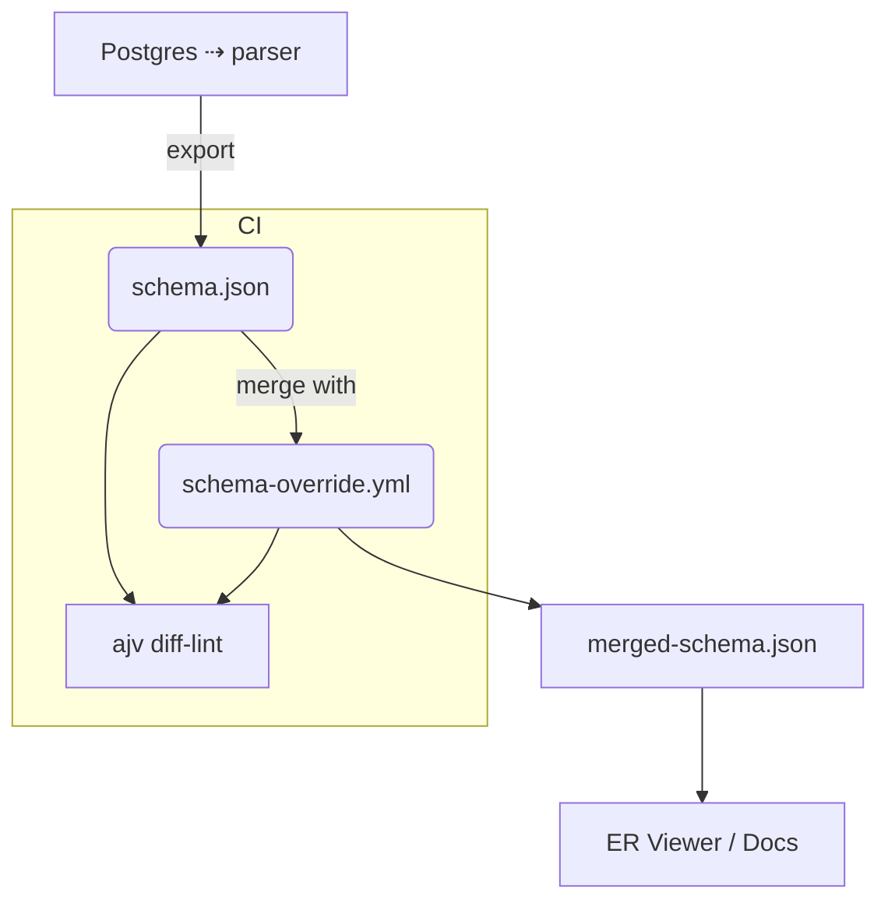

# Schema‑Override & Physical Schema Specifications (Draft)

> **Status:** Draft — v0.3 (2025‑04‑30)
> 
> This document captures **both** the *schema‑override* layer and the baseline *physical schema (schema.json)* format used in the **Liam** ecosystem.
>
> **New in v0.3** — proposal for **Implementation Requests**: a lightweight, commit‑traceable TODO mechanism embedded inside `schema‑override.yml`.

---

## 1  Purpose

The *schema‑override* mechanism allows contributors to attach rich, contextual metadata to an **existing** database schema.  
It is deliberately **non‑destructive**: **no migration or runtime behaviour** is affected.

The companion *schema.json* format standardises how the physical schema is exported so that

* override validation can cross‑check against reality (CI lint)
* downstream tools (ER viewer, diff, lineage) can consume a single canonical structure.

The new **Implementation Request** block serves as a *living TODO list* that is tightly coupled with the ER diagram and version control history.

---

## 2  Scope

| Covered by this spec                        | Out of scope                                          |
|--------------------------------------------|-------------------------------------------------------|
| Table & column comments, logical groupings | SQL migrations, constraints, indexes tuning          |
| Ad‑hoc relations not present in FK metadata| RLS / policy definitions, performance hints          |
| Physical schema baseline (tables, columns) | Runtime‑specific metadata (Row counts, statistics)    |
| Adding new tables and relationships        | Actual database schema changes                       |
| Adding new columns to existing tables      | Database migrations                                  |

---

## 3  Workflow Overview (high‑level)


```mermaid
flowchart TD
  A[Postgres ⇢ parser] -->|export| B(schema.json)
  B -->|merge with| C(schema‑override.yml)
  C --> D[merged‑schema.json]
  D --> E[ER Viewer / Docs]
  subgraph CI
    B --> F[ajv diff‑lint]
    C --> F
  end
```

---

## 4  Logical Override Layer — `schema-override.yml`

```yaml
overrides:
  # 4.1 Table groups (logical modules)
  tableGroups:
    payments:
      name: "Payments & Refunds"
      tables: [invoice, refund]
      comment: "All financial transaction tables"

  # 4.2 Table‑level overrides
  tables:
    invoice:
      comment: "Issued bill for a customer order"
      columns:
        external_id:
          comment: "Reference from the billing gateway"
      # 4.3 Add new columns to existing tables
      addColumns:
        created_at:
          name: "created_at"
          type: "timestamp"
          default: "now()"
          check: null
          primary: false
          unique: false
          notNull: true
          comment: "Creation timestamp"

  # 4.4 Add completely new tables
  addTables:
    posts:
      name: "posts"
      comment: "Blog posts"
      columns:
        id:
          name: "id"
          type: "uuid"
          default: null
          check: null
          primary: true
          unique: true
          notNull: true
          comment: "Primary key"
        title:
          name: "title"
          type: "varchar"
          default: null
          check: null
          primary: false
          unique: false
          notNull: true
          comment: "Post title"
      indexes: {}
      constraints: {}

  # 4.5 Add new relationships
  addRelationships:
    posts_users_fk:
      name: "posts_users_fk"
      primaryTableName: "users"
      primaryColumnName: "id"
      foreignTableName: "posts"
      foreignColumnName: "user_id"
      cardinality: "ONE_TO_MANY"
      updateConstraint: "CASCADE"
      deleteConstraint: "CASCADE"
```

### 4.6 Schema Override Features

The schema override mechanism provides several key features:

1. **Table Groups**: Organize tables into logical groups for better visualization and documentation.
2. **Table & Column Comments**: Add or override comments on existing tables and columns.
3. **Add New Tables**: Define completely new tables that don't exist in the actual schema.
4. **Add New Columns**: Add new columns to existing tables.
5. **Add New Relationships**: Define relationships between tables that aren't represented by foreign keys in the database.

These features allow for enhanced documentation and visualization without affecting the actual database schema.

---

### 4.7 JSON Schema for Overrides (`schema-override.schema.json`)

```jsonc
{
  "$schema": "http://json-schema.org/draft-07/schema#",
  "title": "Schema Override",
  "type": "object",
  "additionalProperties": false,
  "properties": {
    "overrides": {
      "type": "object",
      "additionalProperties": false,
      "properties": {
        "tableGroups": {
          "type": "object",
          "additionalProperties": {
            "type": "object",
            "required": ["name", "tables"],
            "additionalProperties": false,
            "properties": {
              "name": { "type": "string" },
              "tables": {
                "type": "array",
                "items": { "type": "string" },
                "minItems": 1
              },
              "comment": { "type": "string" }
            }
          }
        },
        "tables": {
          "type": "object",
          "additionalProperties": {
            "type": "object",
            "additionalProperties": false,
            "properties": {
              "comment": { "type": "string" },
              "columns": {
                "type": "object",
                "additionalProperties": {
                  "type": "object",
                  "additionalProperties": false,
                  "properties": {
                    "comment": { "type": "string" }
                  }
                }
              },
              "addColumns": {
                "type": "object",
                "additionalProperties": {
                  "type": "object",
                  "required": ["name", "type", "primary", "unique", "notNull"],
                  "additionalProperties": false,
                  "properties": {
                    "name": { "type": "string" },
                    "type": { "type": "string" },
                    "default": { "type": ["string", "number", "boolean", "null"] },
                    "check": { "type": ["string", "null"] },
                    "primary": { "type": "boolean" },
                    "unique": { "type": "boolean" },
                    "notNull": { "type": "boolean" },
                    "comment": { "type": ["string", "null"] }
                  }
                }
              }
            }
          }
        },
        "addTables": {
          "type": "object",
          "additionalProperties": {
            "type": "object",
            "required": ["name", "columns"],
            "additionalProperties": false,
            "properties": {
              "name": { "type": "string" },
              "comment": { "type": ["string", "null"] },
              "columns": {
                "type": "object",
                "additionalProperties": {
                  "type": "object",
                  "required": ["name", "type", "primary", "unique", "notNull"],
                  "additionalProperties": false,
                  "properties": {
                    "name": { "type": "string" },
                    "type": { "type": "string" },
                    "default": { "type": ["string", "number", "boolean", "null"] },
                    "check": { "type": ["string", "null"] },
                    "primary": { "type": "boolean" },
                    "unique": { "type": "boolean" },
                    "notNull": { "type": "boolean" },
                    "comment": { "type": ["string", "null"] }
                  }
                }
              },
              "indexes": {
                "type": "object"
              },
              "constraints": {
                "type": "object"
              }
            }
          }
        },
        "addRelationships": {
          "type": "object",
          "additionalProperties": {
            "type": "object",
            "required": [
              "name",
              "primaryTableName",
              "primaryColumnName",
              "foreignTableName",
              "foreignColumnName",
              "cardinality",
              "updateConstraint",
              "deleteConstraint"
            ],
            "additionalProperties": false,
            "properties": {
              "name": { "type": "string" },
              "primaryTableName": { "type": "string" },
              "primaryColumnName": { "type": "string" },
              "foreignTableName": { "type": "string" },
              "foreignColumnName": { "type": "string" },
              "cardinality": {
                "type": "string",
                "enum": ["ONE_TO_ONE", "ONE_TO_MANY"]
              },
              "updateConstraint": {
                "type": "string",
                "enum": ["CASCADE", "RESTRICT", "SET_NULL", "SET_DEFAULT", "NO_ACTION"]
              },
              "deleteConstraint": {
                "type": "string",
                "enum": ["CASCADE", "RESTRICT", "SET_NULL", "SET_DEFAULT", "NO_ACTION"]
              }
            }
          }
        }
      }
    }
  }
}
```

---

## 5  Physical Schema Baseline — `schema.json`

*(unchanged from v0.2 — see previous section)*

---

## 6  Next Steps

1. Improve validation for schema overrides to ensure they don't conflict with existing schema.
2. Enhance visualization of added tables and relationships in the ER diagram.
3. Add support for more complex column types and constraints.

---

## 7  Implementation Requests

The *Implementation Requests* feature provides a structured way to propose, track, and implement schema changes over time. It serves as a living TODO list that is tightly coupled with version control and the ER diagram.

### 7.1  Purpose

Implementation Requests allow contributors to:

* Document proposed schema changes directly alongside the schema definition
* Track the status of requested changes through the implementation lifecycle
* Maintain a clear history of schema evolution decisions
* Link schema changes to issues, commits, and pull requests

### 7.2  Structure

Implementation Requests are defined in the `requests` section of the `schema-override.yml` file:

```yaml
# Current schema overrides
overrides:
  # existing overrides...

# Implementation requests for future changes
requests:
  - id: "REQ-2025-05-01-001"
    description: "Add comment functionality"
    status: "open"  # open, in_progress, done, wontfix
    tables:
      add:
        comments:
          definition:
            name: "comments"
            columns:
              id: 
                name: "id"
                type: "uuid"
                default: null
                check: null
                primary: true
                unique: true
                notNull: true
                comment: "Primary key"
              post_id:
                name: "post_id"
                type: "uuid"
                default: null
                check: null
                primary: false
                unique: false
                notNull: true
                comment: "Foreign key to posts table"
              content:
                name: "content"
                type: "text"
                default: null
                check: null
                primary: false
                unique: false
                notNull: true
                comment: "Comment content"
              created_at:
                name: "created_at"
                type: "timestamp"
                default: "now()"
                check: null
                primary: false
                unique: false
                notNull: true
                comment: "Creation timestamp"
            indexes: {}
            constraints: {}
    relationships:
      add:
        comments_posts_fk:
          definition:
            name: "comments_posts_fk"
            primaryTableName: "posts"
            primaryColumnName: "id"
            foreignTableName: "comments"
            foreignColumnName: "post_id"
            cardinality: "ONE_TO_MANY"
            updateConstraint: "CASCADE"
            deleteConstraint: "CASCADE"
    createdBy: "hoshinotsuyoshi"
    createdAt: "2025-05-01T06:45:00Z"
    refs:
      issue: "123"
      commit: null
```

### 7.3  Request Types

Implementation Requests support various operation types:

#### 7.3.1  Table Operations

* **Add Table**: Define a new table to be created
  ```yaml
  tables:
    add:
      new_table_name:
        definition:
          # table definition
  ```

* **Drop Table**: Request removal of an existing table
  ```yaml
  tables:
    drop:
      table_to_remove:
        reason: "This table is no longer needed because..."
  ```

* **Alter Table**: Request changes to an existing table
  ```yaml
  tables:
    alter:
      existing_table:
        changes:
          - type: "rename_column"
            from: "old_name"
            to: "new_name"
            reason: "Standardizing naming conventions"
          
          - type: "modify_column"
            column: "column_name"
            changes:
              type: 
                from: "varchar(100)"
                to: "varchar(255)"
              notNull:
                from: false
                to: true
            reason: "Supporting longer values and ensuring data integrity"
          
          - type: "add_column"
            definition:
              name: "new_column"
              type: "timestamp"
              default: null
              notNull: false
              comment: "New feature data"
            reason: "Supporting new feature X"
          
          - type: "drop_column"
            name: "obsolete_column"
            reason: "No longer used after feature Y was removed"
  ```

#### 7.3.2  Relationship Operations

* **Add Relationship**: Define a new relationship between tables
  ```yaml
  relationships:
    add:
      new_relationship_name:
        definition:
          # relationship definition
  ```

* **Drop Relationship**: Request removal of a relationship
  ```yaml
  relationships:
    drop:
      relationship_to_remove:
        reason: "This relationship is no longer valid because..."
  ```

#### 7.3.3  Other Operations

Similar patterns can be applied to other schema elements:

* **Indexes**: `indexes.add`, `indexes.drop`, `indexes.alter`
* **Constraints**: `constraints.add`, `constraints.drop`, `constraints.alter`

### 7.4  Request Lifecycle

| Status | Description | Visualization |
|--------|-------------|---------------|
| `open` | Proposed change that hasn't been implemented | Displayed with "TODO" badge in ER diagram |
| `in_progress` | Change is being implemented | Displayed with "In Progress" badge |
| `done` | Change has been implemented | No badge, change is reflected in schema |
| `wontfix` | Change was rejected or is no longer needed | Not displayed |

### 7.5  CI Integration

Implementation Requests can be integrated with CI pipelines:

1. **Validation**: Ensure requests follow the correct format
2. **Status Tracking**: Automatically update request status based on commits
3. **Consistency Checks**: Verify that `done` requests match actual schema changes
4. **Stale Request Detection**: Flag `in_progress` requests that haven't been updated

### 7.6  JSON Schema for Implementation Requests

```jsonc
{
  "type": "array",
  "items": {
    "type": "object",
    "required": ["id", "status", "createdBy", "createdAt"],
    "properties": {
      "id": {
        "type": "string",
        "pattern": "^REQ-\\d{4}-\\d{2}-\\d{2}-\\d{3}$"
      },
      "description": { "type": "string" },
      "status": {
        "type": "string",
        "enum": ["open", "in_progress", "done", "wontfix"]
      },
      "tables": {
        "type": "object",
        "properties": {
          "add": { "type": "object", "additionalProperties": { /* table definition */ } },
          "drop": { "type": "object", "additionalProperties": { /* drop details */ } },
          "alter": { "type": "object", "additionalProperties": { /* alter details */ } }
        }
      },
      "relationships": {
        "type": "object",
        "properties": {
          "add": { "type": "object", "additionalProperties": { /* relationship definition */ } },
          "drop": { "type": "object", "additionalProperties": { /* drop details */ } }
        }
      },
      "createdBy": { "type": "string" },
      "createdAt": { "type": "string", "format": "date-time" },
      "refs": {
        "type": "object",
        "properties": {
          "issue": { "type": ["string", "integer"] },
          "commit": { "type": ["string", "null"] }
        }
      }
    }
  }
}
```

### 7.7  Benefits

Implementation Requests provide several advantages:

1. **Documentation**: Changes are documented alongside the schema they affect
2. **Traceability**: Each change is linked to its rationale, creator, and related artifacts
3. **Visibility**: Proposed changes are visible to all stakeholders
4. **Process**: Enforces a structured approach to schema evolution
5. **History**: Maintains a clear record of schema decisions over time

---

*End of Draft v0.3*
